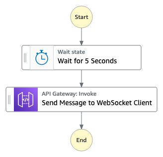

# Amazon API Gateway WebSocket integrations

Modern applications use WebSocket protocol for bidirectional communications. With Amazon API Gateway [WebSocket APIs](https://docs.aws.amazon.com/apigateway/latest/developerguide/apigateway-websocket-api.html) you can build bidirectional communication applications without having to provision and manage any servers. 

Most of the WebSocket samples use AWS Lambda or HTTP(s) as the integration targets and for connect/disconnect route implementation. This sample implementation focuses on using AWS Service integration type to show how you can further simplify serverless architectures.

Sometimes developers need to use URL path in their WebSocket based applications - driven by REST API design best practices for resource naming, or some industry standard requirement such as OCPP for electric vehicle infrastructure. However, API Gateway WebSocket endpoints do not support URL paths besides stage name.

This solution shows how to implement URL path support for WebSocket APIs in Amazon API Gateway using Amazon CloudFront and CloudFront Functions.

## Solution Overview
This example uses Amazon API Gateway WebSocket API to handle bidirectional communications. It tracks connection information in the DynamoDB table. Example uses AWS Lambda for the default business logics implementation along with the AWS Step Functions for an alternative implementation example.


This example does not implement authentication or authorization of the requests. See [documentation](https://docs.aws.amazon.com/apigateway/latest/developerguide/apigateway-websocket-api-control-access.html) if you need to implement access control. You may also check [REST API samples repository](https://github.com/aws-samples/serverless-samples/tree/main/serverless-rest-api) for the Lambda Authorizer sample implementation for a REST API.

### Connection tracking
API Gateway forwards initial connection request to the \$connect route, along with headers and query string information. This solution uses AWS Service integration and data transformation mapping templates to store WebSocket connection IDs in a DynamoDB table instead of a traditional approach that uses AWS Lambda functions to do that. Along with the connection ID in the DynamoDB, it stores headers, query string, request path, and payload. It specifies Time to Live for the object (24 hours) to clean up failed connections if needed. 

In a similar way, $disconnect route uses AWS Service integration along with data transformation mapping templates to delete connection data from the DynamoDB when the client or the server disconnects from the API.

### Business logics implementation
To implement sample business logic, this solution uses AWS Lambda function as an integration target of the \$default route. In the example [function](./src/default.py) responds with the event data, performing no further actions.

The solution also uses AWS Step Functions workflows as an alternative business logics implementation example. API Gateway starts Express workflow execution synchronously or Standard workflow asynchronously, depending on the route. Both workflows are very simple and used only to show AWS service integration capabilities. 

The synchronous execution waits for 5 seconds and returns execution details as a response:


The asynchronous execution returns an execution ID immediately, waits for 5 seconds, and then uses [@connections command](https://docs.aws.amazon.com/apigateway/latest/developerguide/apigateway-how-to-call-websocket-api-connections.html) to send a message to the client:



You can use this AWS service integration approach and sample code for the Step Functions integration in the API Gateway REST endpoints as well.

### URL path support
To support the URL path in Amazon API Gateway WebSocket API, this solution uses Amazon CloudFront distribution and CloudFront Functions. It executes function before the request reaches the API Gateway. It copies the path to the new header called "ws-uri" and removes the path to avoid error raised by WebSocket API if the path is other than stage name.

*Note: Client applications should use CloudFront distribution URL provided in the stack outputs to connect to the WebSocket API to make use of the path.*

## Project structure
This project contains source code and supporting files for a serverless application that you can deploy with the AWS Serverless Application Model (AWS SAM) command-line interface (CLI). It includes the following files and folders:

- `src\default.py` - Code for the application's Lambda functions.
- `template.yaml` - A template that defines the application's AWS resources.

## Deployment
Set this project up like a standard Python project.  
You may need to manually create a virtualenv:

```
$ python3 -m venv .venv
```

After the init process completes and you created the virtualenv, use the following step to activate it.

```
$ source .venv/bin/activate
```

To build and deploy your application for the first time, run the following in your shell:

```bash
sam build --use-container
sam deploy --guided
```

*Note: Deployment will take some time as it creates CloudFront distribution. To make the deployment faster, and if you do not need to use the URL path in your WebSocket endpoint, comment out "Edge" section in the template and corresponding stack outputs.*
## Verification
To verify that application works, connect to the API Gateway WebSocket endpoint using wscat (see [documentation](https://docs.aws.amazon.com/apigateway/latest/developerguide/apigateway-how-to-call-websocket-api-wscat.html) for more details how to set it up). Use CloudFront distribution URL provided in the stack outputs, for example:

```bash
wscat -c "<CloudFront distribution URL>/this/is/my/custom/path/?my_query=foo"
```
**Session Tracking**
After you established the connection, check sessions DynamoDB table specified in the stack outputs to see if a new object was created. It should include path, headers and query string information along with Time to Live value.

**Default Route**
Send any payload (any string) to the API by typing it in. The Lambda function will respond with an event string that will include payload provided, Lambda function execution information, etc. 

**AWS Step Functions Express Synchronous Execution**
Send payload in JSON format and make sure it includes "action" field with "sync_sfn" value, and "data field" that contains input data for Step Functions execution, for example:

{"action": "sync_sfn", "data": "123456"}

Step Functions will start the workflow execution synchronously and will respond with execution details in a few seconds.

*Note: Check [documentation](https://docs.aws.amazon.com/step-functions/latest/apireference/API_StartSyncExecution.html#API_StartSyncExecution_RequestParameters) for correct input parameter format.* 


**AWS Step Functions Standard Asynchronous Execution**
Send payload in JSON format and make sure it includes "action" field with "async_sfn" value and "data field" that contains input data for Step Functions execution, for example:

{"action": "async_sfn", "data": "123456"}

Step Functions will start the workflow execution asynchronously and respond with execution ARN immediately. After a few seconds, you will also receive a message from the workflow execution. 

*Note: Check [documentation](https://docs.aws.amazon.com/step-functions/latest/apireference/API_StartExecution.html#API_StartExecution_RequestParameters) for correct input parameter format.* 


**Session Disconnect**
Disconnect from the API, check the DynamoDB table again, and verify that your session record was deleted.

## Cleanup
To delete the sample application that you created, use the AWS CLI:

```bash
sam delete
```

## Further Steps
As with any example, this is just a limited implementation that should give you an idea for the further steps:
 - Implement business logics that is specific to your use case in the default route integration target [Lambda code](./src/default.py).
 - Add customer ID to the DynamoDB partition key or create an index to query the connection ID by the customer ID if needed.
 - For more complex connection/disconnection event handling, consider using Lambda functions instead of the AWS service integration with DynamoDB
